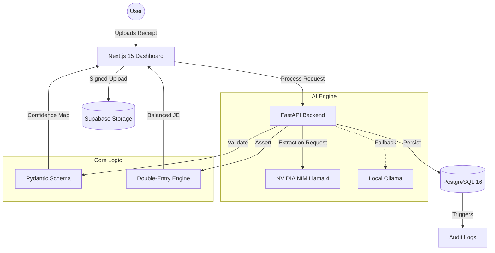
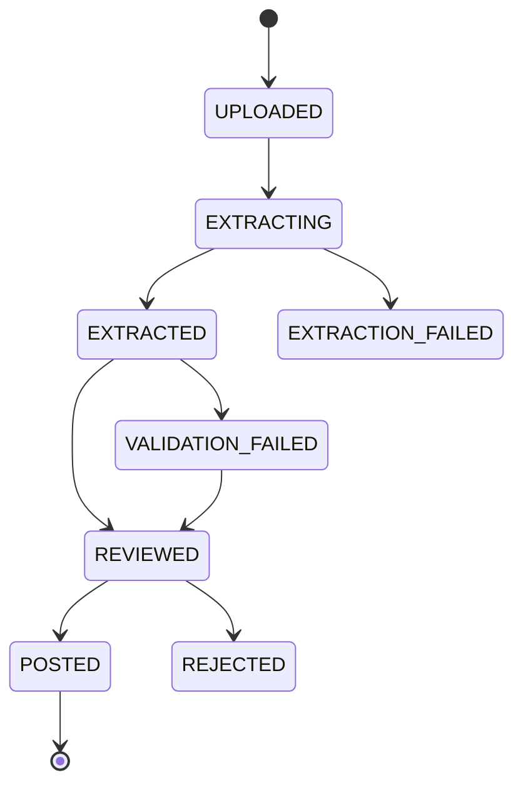

# 🧾 AI Receipt to Journal Entry Generator

<div align="center">
  
  <br />
  <p align="center">
    <b>Transform receipt images into validated, double-entry bookkeeping journal entries using multimodal LLMs.</b>
    <br />
    <i>Production-grade accounting automation with zero monthly overhead.</i>
  </p>
</div>

<div align="center">

[](LICENSE)
[](https://www.python.org/downloads/)
[](https://nextjs.org/)
[](https://fastapi.tiangolo.com/)
[](https://www.postgresql.org/)
[](docker-compose.yml)

</div>

---

## 🌟 Overview

This is a **production-ready** accounting automation tool that takes unstructured receipt images (JPEG, PNG, HEIC, PDF) and converts them into mathematically balanced, double-entry general ledger records. 

Leveraging **Meta Llama 4 Maverick 17B** (via NVIDIA NIM API) and local **Ollama** fallbacks, every entry undergoes rigorous Pydantic schema validation and hard assertion checks (debits must equal credits) before human review and final posting.

> [!IMPORTANT]
> **Zero-Cost Infrastructure**: Designed to run entirely on free-tier services (Vercel, Render, Supabase, NVIDIA NIM) or fully self-hosted for maximum privacy.

---

## ✨ Key Features

### 🤖 Intelligent Extraction
- **Multimodal AI**: High-accuracy extraction using Llama 4 Maverick.
- **Confidence Scoring**: Per-field confidence indicators (Yellow/Orange/Red) to focus human review.
- **Line-Item Detail**: Extracts individual items, quantities, and unit prices.
- **Smart Mapping**: Automatically routes vendors to the correct accounts based on your Chart of Accounts.

### 📊 Professional Bookkeeping
- **Double-Entry Engine**: Automatically constructs balanced Debit/Credit lines.
- **Immutable Ledger**: Posted entries are final; corrections are handled via formal reversals.
- **Audit Trails**: Every mutation is captured via database triggers for 7-year compliance.
- **Export Ready**: One-click PDF reports and CSV exports for your accountant.

### 🛠️ Robust Architecture
- **Human-in-the-Loop**: Split-panel UI for side-by-side receipt review.
- **Resilient Processing**: Exponential backoff, request queuing, and local LLM fallbacks.
- **Privacy First**: PII redaction and signed image URLs with auto-expiry.
- **Developer Friendly**: 100% Type-safe (TypeScript/Pydantic), 90%+ test coverage, and Docker ready.

---

## 🏗️ System Architecture



### Receipt Lifecycle


---

## 🚀 Quick Start (Docker)

The fastest way to get started is using Docker Compose.

1. **Clone the repo**
   ```bash
   git clone https://github.com/yourusername/ai-receipt-journal.git
   cd ai-receipt-journal
   ```

2. **Set up Environment**
   ```bash
   cp backend/.env.example backend/.env
   # Edit backend/.env with your NVIDIA_NIM_API_KEY
   ```

3. **Start Services**
   ```bash
   docker-compose up -d
   ```

4. **Initialize Database**
   ```bash
   docker-compose exec backend alembic upgrade head
   ```

Visit `http://localhost:3000` to start processing receipts!

---

## 🛠️ Technology Stack

| Layer | Technology | Purpose |
|-------|------------|---------|
| **Frontend** | Next.js 15, Tailwind, TanStack Query | Modern, reactive Dashboard |
| **Backend** | FastAPI, SQLAlchemy, Pydantic v2 | High-performance async API |
| **Database** | PostgreSQL 16 (Supabase) | Relational data with RLS & Triggers |
| **AI/ML** | NVIDIA NIM, Ollama | Multimodal LLM Inference |
| **Storage** | Supabase Storage | Secure image & PDF hosting |
| **Auth** | Supabase Auth | JWT-based secure user sessions |

---

## 📦 Project Structure

```text
.
├── backend/                # FastAPI Application
│   ├── app/                # Core logic (API, Models, Services)
│   ├── alembic/            # DB Migrations
│   └── tests/              # Pytest suite (Unit, Integration, Load)
├── frontend/               # Next.js Application
│   ├── app/                # App Router (Dashboard, Review, Upload)
│   ├── components/         # Reusable UI (Glassmorphic design)
│   └── lib/                # API clients & hooks
├── docs/                   # Documentation & Assets
├── scripts/                # Dev & Deployment utilities
└── docker-compose.yml      # Local stack definition
```

---

## 📡 API Quick Reference

| Endpoint | Method | Description |
|----------|--------|-------------|
| `/api/v1/receipts/upload` | `POST` | Upload receipt image/PDF |
| `/api/v1/receipts/{id}/extract` | `POST` | Trigger AI extraction |
| `/api/v1/receipts/{id}/journalize` | `POST` | Post balanced JE to ledger |
| `/api/v1/journal-entries` | `GET` | List posted entries (Paginated) |
| `/api/v1/admin/usage` | `GET` | Monitor free-tier storage limits |

> [!TIP]
> Full interactive documentation is available at `/docs` (Swagger) or `/redoc`.

---

## 🧪 Testing & Quality

We maintain high standards for financial data integrity:

- **Backend**: Run `pytest` for unit and integration tests.
- **Frontend**: Run `npm test` for component tests.
- **E2E**: Run `npx playwright test` for full flow validation.
- **Load**: Run `k6 run scripts/load_test.js` to verify rate-limiting logic.

---

## 🚢 Deployment

### Production Stack
- **Database**: Supabase (Postgres 16)
- **Backend**: Render (Web Service)
- **Frontend**: Vercel (Next.js)
- **AI**: NVIDIA NIM (Hobby Tier)

See [DEPLOYMENT.md](DEPLOYMENT.md) for a step-by-step guide on setting up your zero-cost production environment.

---

## 🏠 Self-Hosting (Privacy Mode)

For 100% data privacy, run with local models:
1. Install [Ollama](https://ollama.ai).
2. `ollama pull qwen2.5-vl:7b`.
3. Set `OLLAMA_HOST` in your `.env`.
4. Your receipts never leave your local network.

---

## 🤝 Contributing

We welcome contributions! Please see our [CONTRIBUTING.md](CONTRIBUTING.md) for style guides and PR processes.

1. Fork the Project.
2. Create your Feature Branch (`git checkout -b feature/AmazingFeature`).
3. Commit your Changes (`git commit -m 'Add some AmazingFeature'`).
4. Push to the Branch (`git push origin feature/AmazingFeature`).
5. Open a Pull Request.

---

## 📄 License

Distributed under the MIT License. See `LICENSE` for more information.

---

## 🙏 Acknowledgments

- [NVIDIA NIM](https://build.nvidia.com) for the incredible Llama 4 API.
- [Supabase](https://supabase.com) for the robust Postgres infrastructure.
- [Ollama](https://ollama.ai) for enabling local AI privacy.
- [FastAPI](https://fastapi.tiangolo.com) & [Next.js](https://nextjs.org) for the DX.

<p align="right">(<a href="#top">back to top</a>)</p>
